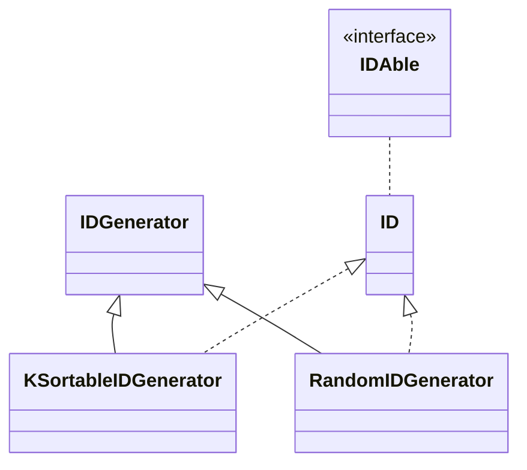

# Jdentifiers

Generics-based, type safe, k-sortable 128-, 64- and 32-bit unique identifiers

## What

3 main identifier types:

* LID: Locally scoped Identifier
  32-bit / 4-byte / ~2x10^9 identifier scoped to a specific entity, fx within a composite index for a tenant, for
  example `(organization_id, group_id)`,
* ID: Entity Identifier
* 64-bit / 8-byte / ~9x10^18 identifier denoting an entity, normally a unique identifier / primary key for a specific
  entity within a single system.
* GID: Globally Unique Identifier
  128-bit / 16-byte / ~1.7X10^38 identifier denoting an entity globally unique across multiple systems,  
  specially conforms to either UUID v4 or UUID v7.

# Goals

* Low overhead of abstractions

# Why

There is already great implementations out there,
but xlid doesn't allow you to use the type system to differentiate between the different entities or aggregates in a
system.
type-id only differentiate on the final output string with a custom prefix, but not in the type system.

What we love is the UUIDv7-style time-sortable / k-sortable randomly generated identifiers that can safely be used
for primary keys in an active distributed system.

The idea of prefixing identifiers as done by Stripe (ref) is interestingly, but it comes with considerable overhead.
This library
aims to be able to support custom prefix if desired, but not out of the box in the default toString.

For low throughput entities, shorter ids generated with a similar approach can likewise benefit. These would often be
non-globally unique identifiers, for example such as a Team within an Organization in a multi-tenant system.

Split the generation of the identifiers, such that different use cases can choose whatever strategy for generation that
suits the use case the best, without having the API consumers having to be aware of how the identifier was generated.
For example, for new Organization Identifiers (`ID<Organization>`), k-sortable may be suitable, however for

The default "ID" implementation uses 8-bytes / 64-bit as opposed to 16-byes / 128-bit (UUID). This is highly subjective
choose, but the author of the API's understanding of the use cases, must entities in a modern multi-tenant SaaS product,
even a highly popular one, does not exceed more than 2^63 entities. For example as of 2014 Twitter saw around 6,000
tweets
per second in average (200 billion per
year) ([ref](https://blog.twitter.com/official/en_us/a/2014/the-2014-yearontwitter.html)),
yet they can still fit it Tweet identifiers within a 64-bit as it would take ~200 million years to exhaust the potential
identifier space.

Why inject the encoding / decoding from the generator?
This allows the consumer of the API to change the human-readable format if the default doesn't suit the use case.
Maybe this isn't a great idea, since fromString / fromLong etc. would then need to pass the codec?

## Why generics / typed identifiers

Why not just "ID" - why the complexity of adding `<? extends IDAble>`?

```java
        ID<Organization> orgId = null;
        ID<User> userId = null;
        myServiceFn(userId, orgId);

        void myServiceFn(ID<Organization> orgId, ID<User> userId) {

        }
```

## ID: 64-bit identifier

<table>
  <thead>
    <td>Offsets</td>
    <td>Octet</td>
    <td colspan="8">0</td>
    <td colspan="8">1</td>
    <td colspan="8">2</td>
    <td colspan="8">3</td>
  </thead>
  <tr>
    <td>Octet</td>
    <td>Bit</td>
    <td>0</td>
    <td>1</td>
    <td>2</td>
    <td>3</td>
    <td>4</td>
    <td>5</td>
    <td>6</td>
    <td>7</td>
    <td>8</td>
    <td>9</td>
    <td>10</td>
    <td>11</td>
    <td>12</td>
    <td>13</td>
    <td>14</td>
    <td>15</td>
    <td>16</td>
    <td>17</td>
    <td>18</td>
    <td>19</td>
    <td>20</td>
    <td>21</td>
    <td>22</td>
    <td>23</td>
    <td>24</td>
    <td>25</td>
    <td>26</td>
    <td>27</td>
    <td>28</td>
    <td>29</td>
    <td>30</td>
    <td>31</td>
  </tr>
  <tr>
    <td>0</td>
    <td>0</td>
    <td>r</td>
    <td colspan="31">timestamp</td>
  </tr>
  <tr>
    <td>4</td>
    <td>32</td>
    <td colspan="10">timestamp</td>
    <td colspan="10">instance</td>
    <td colspan="12">sequence</td>
  </tr>
</table>

* r: Reserved signed bit
* timestamp: 41-bit
* instance id: 10-bit
* sequence id: 12-bit

# Limitations

- Max unique identifiers per second:
- Time wrap-around:

# Performance / benchmarks

# API choices

Why not have the different identifiers lengths share a common base interface?
There currently isn't a common method between the implementations that isn't already available in other interfaces (
Comparable)
or base classes (Object).

## Encoding (hex / base16)

String representations for a 64-bit integer:
binary: 8 bytes  (100%) -63.6%
base64: 11 bytes (138%) -50.0%
base32: 13 bytes (163%) -40.9%
base16: 16 bytes (200%) -27.3%
base10: 22 bytes (275%)

Encode performance (Intel MBP 16", i9):
encode copy baseline?
base16: 48m/sec
base32: 11m/sec
base64: 34m/sec

Why Base 32?
Example for the 128-bit identifier:
Binary: 16 bytes
Base64(Url safe): 20 bytes (20% over base32)
Base32: 26 bytes (20-21% over hex)
Base16 / hex: 32 bytes
UUID Hex: 36 bytes

Space efficiently is important, especially in storage, and we recommend always using a binary representation if
available.
For API over textual protocols such as Json or XML, we feel the sweet the spot is Base32.

It's important to be able to pronounce the characters without confusion, as the human-readable text format is primarily
aimed at humans.

Base32 has been chosen by x, y z also.

A problem with the dashes is that they prevent double-clicking in current OS for copying.

# Development

## UML Diagram



## Roadmap
- fromBits method
- Benchmarks
- Deterministic derive methods
- KSortable ID<T>
- KSortable LID<T>
- KSortable GID<T>
- Jackson Converter
- Jakarta XmlAdapter
- Json-B JsonbAdapter
- Jakarta JAX-RS ParamConverters
- javax JAX-RS ParamConverters
- Micronaut TypeConverter
- Spring Converter
- BOM module for dependency management
- AWS SDKv1 Generator node hasher
- AWS SDKv2 generator node hasher
- Consul generator node hasher
- Short and long-lived identifiers (default long-lived)
- Hibernate UuidGenerator / ID (BeforeExecutionGenerator)
- Example: Micronaut / data / AWS instance id / postgres
- Example: Spring / Hibernate / k8s pod id
- Example: Dropwizard / consul
- Example: Quarkus / ???
- BID - Business Identifiers

# Credits & Related work

- Snowflake (Twitter)
  https://github.com/twitter-archive/snowflake
  https://dl.acm.org/doi/10.5555/70413.70419
- https://github.com/segmentio/ksuid
- https://github.com/ksuid/ksuid
- https://github.com/ulid
- https://github.com/azam/ulidj
- https://github.com/jetpack-io/typeid
- https://www.ietf.org/archive/id/draft-ietf-uuidrev-rfc4122bis-00.html#section-11.2
